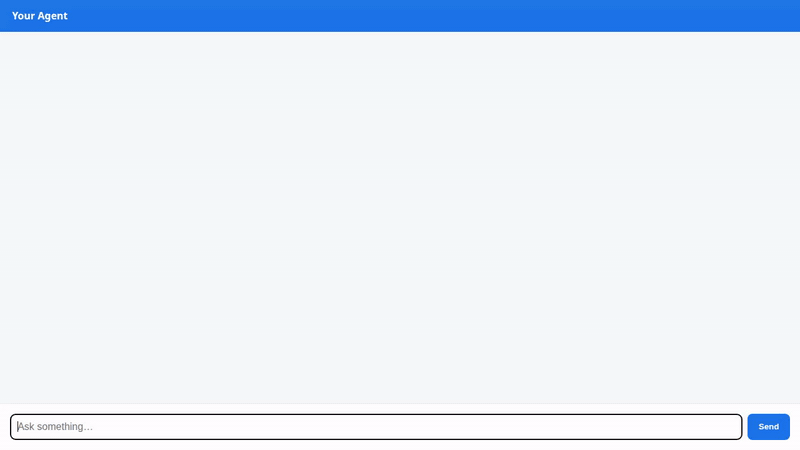

# Smart Pantry Recipe Concierge

An AI-powered culinary assistant built with the **Google Agent Development Kit (ADK)**. The Smart Pantry Recipe Concierge helps home cooks discover recipes based on available ingredients, scale portion sizes, manage favorite cookbooks, remember long-term dietary restrictions, generate visual dish imagery, and present responses using structured **A2UI** cards.



---

## Key Features & Tools

The agent implements the following features backed by real Google Cloud services:

* **Ingredient & Recipe Search (`search_recipes`)**: Queries a Cloud Firestore database of recipes by ingredients on hand or dietary tags (e.g., `vegan`, `gluten-free`, `quick`).
* **Personal Cookbook Management (`save_favorite_recipe`, `get_favorite_recipes`)**: Persists and retrieves favorite recipes marked by the user in Firestore.
* **Portion & Serving Scaling (`scale_recipe_servings`)**: Dynamically computes adjusted ingredient quantities and scale factors for target serving sizes.
* **Dish Imagery Generation (`generate_recipe_image`)**: Generates high-resolution dish photography using the `gemini-3.1-flash-lite-image` model via Vertex AI and uploads images to Google Cloud Storage.
* **Long-Term Dietary Memory (`save_user_preference`, `load_user_preferences`)**: Stores and recalls user allergies, dietary restrictions, and ingredient dislikes across sessions using Vertex AI Memory Bank Service.
* **Rich Adaptive Cards (A2UI)**: Transforms LLM responses into structured card layouts (Cards, Columns, Text, Images) via `A2uiSchemaManager` (v0.8) and an `after_model_callback` interceptor.

---

## Google Cloud Services Integrated

* **Vertex AI Memory Bank Service**: Persists long-term user preferences and allergy profiles across sessions under a Reasoning Engine resource.
* **Google Cloud Firestore**: Serves as the database for recipe documents, ingredients, dietary tags, and saved favorites.
* **Google Cloud Storage (GCS)**: Stores and hosts generated dish imagery with public HTTPS URLs.
* **Vertex AI / Gemini**: Uses `gemini-flash-latest` for natural language reasoning and `gemini-3.1-flash-lite-image` for visual generation.
* **Agent Engine Runtime**: Hosts the ADK agent over the Agent-to-Agent (A2A) protocol.

---

## Repository Architecture

```text
smart-pantry-concierge/
├── app/
│   ├── agent.py          # Root agent definition, Gemini model, memory service, and A2UI schema prompt
│   ├── tools.py          # Firestore, Cloud Storage, Imagen, and Memory Bank tool implementations
│   ├── a2ui_utils.py     # Callback interceptor formatting A2UI cards for A2A data parts
│   └── fast_api_app.py   # ADK FastAPI application entrypoint
├── frontend/
│   ├── main.py           # FastAPI proxy forwarding user queries to Agent Engine over A2A
│   ├── requirements.txt  # Frontend dependencies (FastAPI, uvicorn, a2a-sdk)
│   └── static/
│       └── index.html    # Chat interface with built-in A2UI mini-renderer
├── agents-cli-manifest.yaml # Agent Engine deployment configuration
├── demo.gif              # Optimized looping demonstration GIF
└── README.md             # Project documentation
```
